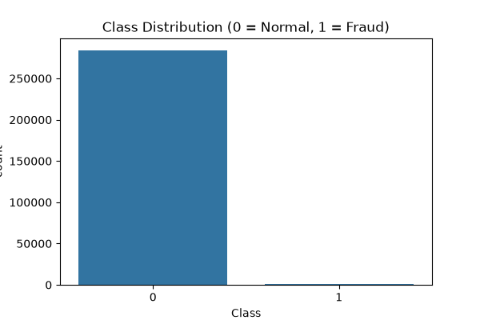
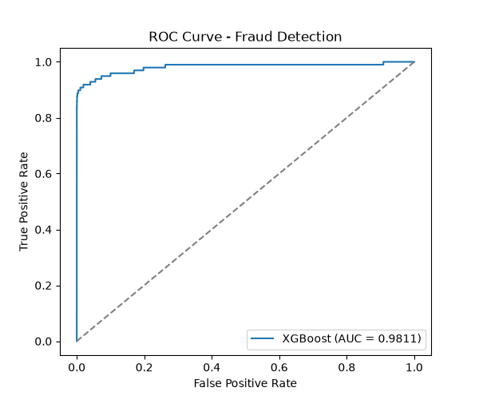

# Credit Card Fraud Detection

A machine learning project for detecting potentially fraudulent credit card transactions using data preprocessing, anomaly detection, and XGBoost classification.

## 📌 Project Overview

Credit card fraud detection is a classification problem where the goal is to identify suspicious transactions while minimizing incorrect classifications of legitimate transactions.

This project implements an end-to-end machine learning workflow:

* Exploratory Data Analysis (EDA)
* Data preprocessing
* Fraud and non-fraud class analysis
* Anomaly detection
* XGBoost model training
* Model evaluation
* Model serialization
* Fraud prediction application

The trained XGBoost model is integrated into an application that can be used to make fraud predictions.

---

## 🎯 Objectives

The main objectives of this project are:

1. Explore and understand credit card transaction data.
2. Analyze the distribution of fraudulent and legitimate transactions.
3. Preprocess transaction data for machine learning.
4. Investigate anomalous transaction patterns.
5. Train an XGBoost fraud detection model.
6. Evaluate the trained model.
7. Save the trained model for reuse.
8. Build an application for fraud prediction.

---

## 🛠️ Technologies Used

* Python
* Pandas
* NumPy
* Scikit-learn
* XGBoost
* Matplotlib
* Joblib / Pickle
* Streamlit
* Git
* GitHub

---

## 📂 Project Structure

```text
credit-card-fraud-detection/
│
├── app/
│   └── app.py
│
├── models/
│   ├── feature_columns.pkl
│   └── xgboost_fraud_model.pkl
│
├── notebooks/
│   ├── 01_eda_preprocessing.py
│   ├── 02_anomaly_detection.py
│   └── 03_train_xgboost.py
│
├── reports/
│   ├── class_distribution.png
│   └── roc_curve.png
│
├── .gitignore
├── README.md
└── requirements.txt
```

---

## 🔍 Project Workflow

### 1. Exploratory Data Analysis

The project begins with exploratory data analysis to understand the transaction dataset.

The analysis focuses on:

* Dataset structure
* Feature information
* Missing values
* Transaction characteristics
* Fraud and legitimate transaction distribution
* Data visualization

The class distribution is visualized in the generated report.

### Class Distribution



---

### 2. Data Preprocessing

The transaction data is processed and prepared for machine learning.

The preprocessing workflow prepares the input features and target variable for model training and prediction.

The feature information used by the trained model is stored in:

```text
models/feature_columns.pkl
```

---

### 3. Anomaly Detection

Fraudulent transactions can contain patterns that differ from normal transactions.

An anomaly detection stage is included to investigate unusual transaction behavior and provide an additional perspective on fraudulent activity.

The anomaly detection process is implemented in:

```text
notebooks/02_anomaly_detection.py
```

---

### 4. XGBoost Classification

The main supervised learning model used in this project is **XGBoost**.

XGBoost is a gradient boosting algorithm designed for efficient and accurate machine learning on structured data.

The model is trained using the processed transaction features and the corresponding fraud classification target.

The training process is implemented in:

```text
notebooks/03_train_xgboost.py
```

The trained model is saved as:

```text
models/xgboost_fraud_model.pkl
```

---

## 📊 Model Evaluation

The trained model is evaluated using classification metrics and visual analysis.

The project includes a generated ROC curve:

### ROC Curve



The evaluation process can be found in:

```text
notebooks/03_train_xgboost.py
```

The model evaluation considers the performance of the fraud classification system rather than relying only on accuracy.

---

## 🚀 Installation

### Clone the repository

```bash
git clone https://github.com/sadiqfaisal/credit-card-fraud-detection.git
```

### Navigate to the project

```bash
cd credit-card-fraud-detection
```

### Create a virtual environment

Windows:

```powershell
python -m venv venv
```

### Activate the virtual environment

PowerShell:

```powershell
.\venv\Scripts\Activate.ps1
```

### Install dependencies

```powershell
pip install -r requirements.txt
```

---

## ▶️ Running the Application

The project contains an application in:

```text
app/app.py
```

Run the application using:

```powershell
streamlit run app/app.py
```

The application uses the saved XGBoost model and feature columns to perform fraud predictions.

---

## 🧪 Running the Machine Learning Pipeline

### EDA and Preprocessing

```powershell
python notebooks/01_eda_preprocessing.py
```

### Anomaly Detection

```powershell
python notebooks/02_anomaly_detection.py
```

### Train the XGBoost Model

```powershell
python notebooks/03_train_xgboost.py
```

---

## 📈 Project Outputs

The project produces and stores several important outputs.

### Trained Model

```text
models/xgboost_fraud_model.pkl
```

### Feature Columns

```text
models/feature_columns.pkl
```

### Class Distribution Visualization

```text
reports/class_distribution.png
```

### ROC Curve

```text
reports/roc_curve.png
```

These files allow the trained model and generated analysis results to be reused by the application and documented as part of the project.

---

## 💡 Key Concepts Demonstrated

This project demonstrates practical experience with:

* Exploratory Data Analysis
* Data preprocessing
* Binary classification
* Fraud detection
* Anomaly detection
* XGBoost
* Model evaluation
* ROC curve analysis
* Model serialization
* Python application development
* Git and GitHub
* Machine learning deployment

---

## 🔮 Future Improvements

Potential future improvements include:

* Hyperparameter optimization
* Additional feature engineering
* Cross-validation
* Improved handling of class imbalance
* Threshold optimization
* Explainable AI using SHAP
* Real-time fraud detection
* Model monitoring
* Automated model retraining
* Cloud deployment
* Database integration
* Improved application interface

---

## ⚠️ Disclaimer

This project was developed for educational and internship purposes.

The predictions produced by the model should not be considered a definitive determination of whether a real-world transaction is fraudulent. Production fraud detection systems require additional validation, monitoring, security controls, and domain-specific requirements.

---

## 👨‍💻 Author

**Sadiq Faisal**

GitHub: https://github.com/sadiqfaisal

Project Repository: https://github.com/sadiqfaisal/credit-card-fraud-detection

---

## 📄 License

This project is intended for educational and demonstration purposes.
